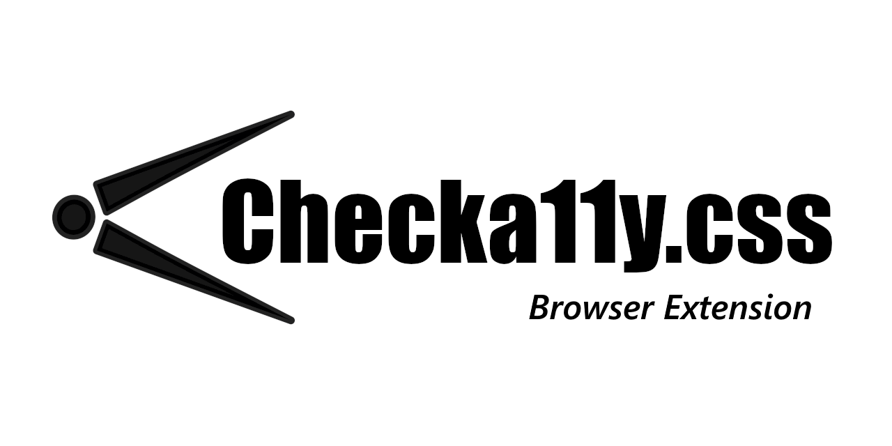

<div align="center">

  

  <a href="https://www.buymeacoffee.com/jackdomleo7" target="_blank"></a> <a href="https://www.producthunt.com/posts/checka11y-css?utm_source=badge-featured&utm_medium=badge&utm_souce=badge-checka11y-css" target="_blank"></a>

   [](https://github.com/jackdomleo7/Checka11y.css-browser-extension/blob/master/LICENSE)

  [](https://github.com/jackdomleo7/Checka11y.css-browser-extension/stargazers) [](https://chrome.google.com/webstore/detail/checka11ycss/npkoehgjmnffjdaelommnfjkflenbfaa) [](https://addons.mozilla.org/en-GB/firefox/addon/checka11y-css)
  
</div>

---

# Checka11y.css - browser extension

**A CSS stylesheet to quickly highlight a11y concerns.**

_Lightweight_ &bull; _Modern_ &bull; _Accessibile_ &bull; _Customisable_ &bull; _Simple_

The first line of defence for testing accessibility.

Designed to quickly highlight some common accessibility errors and warnings that can be easily and quickly rectified.

Recommended before turning to automation tools and scanners such as Lighthouse on Chrome.

This is the browser extension for [Checka11y.css](https://github.com/jackdomleo7/Checka11y.css). It allows you to toggle on and off the Checka11y.css stylesheet on any webpage so you can debug your webpage's accessibility.

Browsers supported:
- [Chromium](https://chrome.google.com/webstore/detail/checka11ycss/npkoehgjmnffjdaelommnfjkflenbfaa)
- [Firefox](https://addons.mozilla.org/en-GB/firefox/addon/checka11y-css)

---

## Dev

###### Prerequisites
```
npm i -g web-ext
```

###### Debug the extension in Firefox
```
web-ext run
```

OR

- In Firefox, navigate to `about:debugging`
- Click "This Firefox"
- Click "Load Temporary Add-on" and choose the directory `Checka11y.css-browser-extension`

###### Debug the extension in Chrome
- In Chrome, navigate to `chrome://extensions`
- Enable `Developer mode`
- Click "Load unpacked extension" and choose the folder `Checka11y.css-browser-extension`

###### Package up the browser extension ready for publishing
```
web-ext build
```

---

<div align="center">

  [GitHub](https://github.com/jackdomleo7/Checka11y.css "View the GitHub repo and maybe give us a star") &bull; [npm](https://www.npmjs.com/package/checka11y-css "View Checka11y.css on npmjs.com") &bull; [yarn](https://yarnpkg.com/package/checka11y-css "View Checka11y.css on yarnpkg.com") &bull; [docs](https://checka11y.jackdomleo.dev "Read the official documentation") &bull; [CHANGELOG](https://github.com/jackdomleo7/Checka11y.css/releases "Read all the releases") &bull; [License](https://github.com/jackdomleo7/Checka11y.css#license "MIT License") &bull; [Chrome Web Store](https://chrome.google.com/webstore/detail/checka11ycss/npkoehgjmnffjdaelommnfjkflenbfaa) &bull; [Firefox add-on](https://addons.mozilla.org/en-GB/firefox/addon/checka11y-css)

</div>